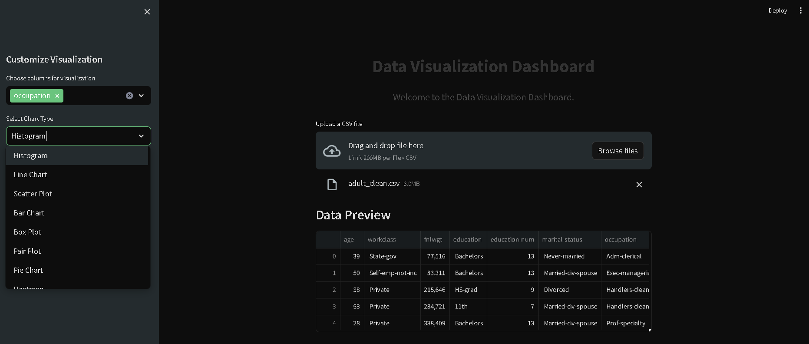

# Data Visualization Dashboard

## Overview

Welcome to the Data Visualization Dashboard! This interactive dashboard allows you to visualize and explore your data using various chart types. You can upload a CSV file, select columns for visualization, and customize the charts to gain insights from your data.

## Features

- Upload a CSV file for analysis.
- Choose columns for visualization.
- Select from multiple chart types, including histograms, line charts, scatter plots, bar charts, box plots, pair plots, pie charts, heatmaps, and count plots.
- Download the analyzed data as a CSV file.

## Usage

1. **Upload Data**: Click the "Upload a CSV file" button to upload your data in CSV format.

2. **Customize Visualization**:
   - Use the sidebar to select columns for visualization.
   - Choose a chart type from the dropdown menu.
   - Customize chart-specific options (e.g., x-axis, y-axis).

3. **Explore Your Data**: Interact with the visualizations to explore patterns and trends in your data.

4. **Download Data**: If you want to download the analyzed data, click the "Download Data as CSV" button.

## Dependencies

- Streamlit
- Pandas
- Matplotlib
- Plotly
- Seaborn

## Project Creator

- [Prikshit Sharma](https://github.com/Prikshit7766)